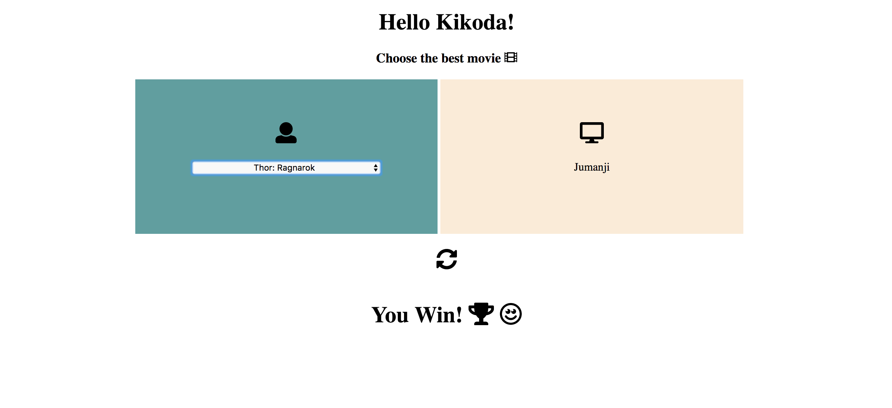

# bet-movie
A small and interesting game built using web technologies and the movie database API

#### Set-up
1. Download/Clone repository
2. Open homepage.html in browser (preferably Google Chrome)
3. And start playing!!

Note: Internet connection is expected to get jQuery, font-awesome and angular through CDNs, otherwise download source for those libraries

#### Game:
1. CPU takes a movie at random from the database
2. User has to choose the possible best movie (measured based on user voting average metric) from the list provided
3. If user can make a best bet, he/she wins! 

#### Implementation:
HTML5, CSS, jQuery, font-awesome and AngularJS            
API: https://www.themoviedb.org/

#### Acknowledgement:
Implemented as part of http://challenge2018.kikoda.com/

###### Homepage Screenshot

